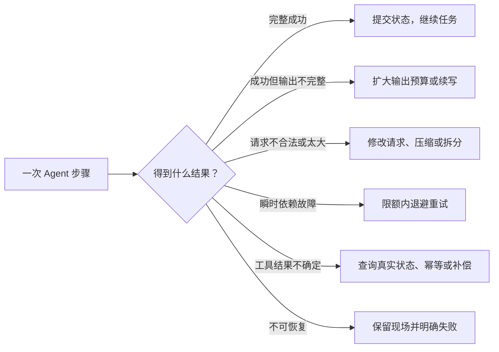

## 一、为什么普通聊天不明显，Agent 却必须处理恢复

普通聊天一次请求失败，刷新重试即可。

Agent 完成一个任务可能需要：

1. 调模型；
2. 读取文件；
3. 修改代码；
4. 执行测试；
5. 再调模型分析结果；
6. 继续修改；
7. 最后提交结果。

如果每一步成功率都是 99%，连续 30 步全部成功的概率只有：

```
0.99 ^ 30 ≈ 74%
```

这是简化计算，但说明了本质：**任务越长，局部小概率故障越会累积成常见故障。**

更麻烦的是，Agent 失败时往往已经完成了一半工作。此时不能简单“从头再来”：

- 已写入的文件可能被重复修改；
- 已执行的部署可能被执行第二次；
- 已发送的邮件不能撤回；
- 已消耗的 token 和时间无法退还；
- 重新生成的回答可能与前半段不一致；
- 丢失上下文后，Agent 甚至不知道自己做过什么。

所以真实需求不是“别崩溃”，而是：

> 在部分工作已经发生后，仍然能把系统推进到一个已知、正确、可解释的状态。

## 二、错误恢复首先是分类问题

教程把 s11 概括为“升级 token、压缩上下文、429/529 重试”。方向没错，但真实工程里的失败至少分六层。

| 失败层次     | 示例                                           | 能否原样重试 | 正确方向                  |
| -------- | -------------------------------------------- | ------ | --------------------- |
| 请求格式或权限  | 参数错误、401、403、模型不支持该能力                        | 否      | 修正配置或立即失败             |
| 服务瞬时故障   | 网络断开、超时、500、529                              | 通常可以   | 有上限的退避重试              |
| 流量与配额    | 429、并发过高、token 速率超限                          | 视情况    | 遵守 `Retry-After`，降低流量 |
| 输入容量不足   | prompt/context 太长、请求体过大                      | 否      | 压缩、裁剪或拆分请求            |
| 成功但输出未完成 | `max_tokens`、`model_context_window_exceeded` | 不是普通重试 | 扩大预算或延续生成             |
| 工具及业务失败  | 测试失败、命令超时、部署结果未知                             | 取决于副作用 | 自我修正、查询状态、补偿或人工介入     |

Anthropic 官方也明确区分了两类信号：

- HTTP/API 异常表示请求处理失败；
- `stop_reason` 表示请求成功了，但模型为什么停止。

当前官方列出的停止原因还包括 `pause_turn`、`refusal` 和 `model_context_window_exceeded`，教程只覆盖了其中一部分。[Anthropic stop reason 文档](https://platform.claude.com/docs/en/build-with-claude/handling-stop-reasons)

因此，一个合理的宏观流程是：

```

```

关键点是：**不同失败必须产生不同状态迁移，不能全部走一个 retry。**

## 三、最难的痛点不是重试，而是“刚才到底成功没有”

例如 Agent 调用部署工具后超时，有两种可能：

- 请求没有到达服务器；
- 服务器已经部署成功，只是响应丢了。

此时直接重试可能部署两次。

这就是分布式系统里的“结果未知”问题。解决它通常需要：

- 幂等键：同一个操作编号执行多次，也只产生一次效果；
- 状态查询：重试前先查询部署是否已经存在；
- 检查点：记录该步骤是否已经提交；
- 补偿动作：如果后续失败，撤销前面的预留或临时资源。

“幂等”可以简单理解为：**同一个动作重复执行，最终效果仍然与执行一次相同。** AWS 也把幂等契约视为安全重试的前提，否则网络超时后的重试可能创建重复资源。[AWS 关于安全重试与幂等 API](https://aws.amazon.com/builders-library/making-retries-safe-with-idempotent-APIs/)

这也是教程最大的范围缺口：它只重试模型 API，没有处理 Agent 已执行工具之后的业务副作用。

## 四、重试本身会制造新故障

重试不是免费的：

- 增加响应时间；
- 重复消耗输入、输出 token；
- 加重已经过载的服务；
- 大量客户端同时重试会形成“惊群效应”；
- 多层 SDK 和业务代码同时重试会产生重试倍增。

Anthropic Python SDK已经默认对连接错误、408、409、429 和 5xx 自动重试两次，并采用指数退避；官方也建议捕获具体异常类型，而不是匹配错误字符串。[Anthropic Python SDK](https://platform.claude.com/docs/en/cli-sdks-libraries/sdks/python) [Anthropic API 错误文档](https://platform.claude.com/docs/en/api/errors)

而教程的 [`with_retry` (line 182)](/D:/learn_claudecode/learn-claude-code/s11_error_recovery/code.py:182) 外层最多再循环 10 次。如果不关闭 SDK 内置重试，理论上可能放大到约 30 次真实 HTTP 尝试。

真实系统必须先决定：

> 重试责任究竟属于 SDK、模型网关，还是 Agent Harness？

我的建议是只保留一个主要责任层。上层 Agent 只负责“是否换策略”，不要再次复制底层网络重试。

同时，重试预算不能只有 `max_retries`，还应包括：

- 最大总耗时；
- 最大累计等待；
- 最大 token/费用；
- 用户取消信号；
- 整个任务的截止时间；
- 连续无进展次数。

## 五、上下文恢复的难点是保持语义和协议完整

教程的 reactive compact 直接保留最后五条消息：

```
tail = messages[-5:]
```

这只能展示“缩短上下文”这个概念，不能直接用于真实工程。

原因有两个：

1. 旧消息可能包含任务约束、已完成工作和重要决策，删除后 Agent 会忘记事实；
2. `tool_use` 和 `tool_result` 必须保持配对，任意截断可能留下孤立工具结果，导致下一次 API 请求直接报 400。Anthropic 官方明确要求工具调用与结果保持正确顺序和完整配对。[工具消息约束](https://platform.claude.com/docs/en/build-with-claude/handling-stop-reasons)

真正的上下文恢复至少要保存：

- 用户原始目标；
- 当前计划和完成进度；
- 已修改文件与关键结果；
- 未解决错误；
- 仍有效的约束；
- 完整的近期工具调用边界。

所以压缩不是字符串裁剪，而是一次“状态迁移”：把历史对话转化为更小但仍可继续工作的任务状态。

## 六、输出截断也不是一种统一故障

`max_tokens` 表示模型成功生成了内容，只是达到本次输出上限。

不同输出不能采用相同恢复方式：

- 普通说明文字：可以保存前半段，再让模型续写；
- 一整个 JSON：截断后往往无法解析，通常应提高上限后重新生成；
- 工具调用参数：截断的参数不能执行，应重新请求完整工具调用；
- 代码文件：盲目续写可能从错误字符位置接上，需要结构校验；
- 超长任务：更合理的办法可能是拆分工作，而不是一次允许输出 64K。

所以“8K → 64K”不是通用恢复策略。它会增加延迟和费用，还受到具体模型输出能力限制。正确决策应由输出类型和完整性契约决定。

## 七、模型 fallback 也不是简单换个名称

切换备用模型还会带来：

- 工具调用能力是否一致；
- 上下文窗口是否一致；
- 输出上限是否一致；
- 安全策略是否一致；
- 成本和响应速度变化；
- 对同一上下文的理解是否连续；
- 是否支持当前请求中的特定功能。

所以 fallback 的本质是“能力兼容的路由策略”，不只是 `current_model = FALLBACK_MODEL`。

而且当前教程代码确实有一个确定的问题：[`lambda` 在创建时捕获了旧的 `mdl` (line 274)](/D:/learn_claudecode/learn-claude-code/s11_error_recovery/code.py:274)，`with_retry` 内即使更新 `state.current_model`，本轮后续重试仍调用旧模型。因此教程宣称的 fallback 在当前实现中实际上不会生效。

此外：

- `retry_after` 参数虽然存在，但调用时没有从异常响应中传入；
- 使用异常名称和字符串判断错误，而不是 SDK 的具体异常类型；
- 没记录 `request_id`，生产排障时缺少关键证据。

这些之后实现 s11 时不能照抄。

## 八、真实 s11 应解决的五个核心需求

我建议把我们要学习的 s11 定义为以下五件事：

1. 失败分类  
   明确区分成功、未完成、可重试、需变换请求、需人工处理和永久失败。

2. 恢复状态机  
   每类失败只能走规定的路径，并记录已经尝试过什么，防止循环。

3. 有界恢复  
   用尝试次数、总耗时、token、费用和无进展次数共同限制恢复。

4. 状态与副作用安全  
   明确哪些步骤可以重复，哪些必须使用幂等键、状态查询或检查点。

5. 可观测与可解释  
   记录错误类型、请求 ID、重试次数、等待时间、模型切换和最终退出原因。

成熟 Agent 框架也把“重试、超时、错误路由、检查点恢复”作为相互独立但可组合的机制，而不是一个大 `try/except`。例如 LangGraph 的故障容错把 retry、timeout、error handler 和 checkpoint 分开处理。[LangGraph fault tolerance](https://docs.langchain.com/oss/python/langgraph/fault-tolerance) [LangGraph persistence](https://docs.langchain.com/oss/javascript/langgraph/persistence)

## 九、和前后章节的真实关系

从宏观上看：

- s08 Context Compact：尽量提前避免上下文溢出；
- s11 Error Recovery：失败发生后决定如何转换状态；
- s12 Task System：把任务进度变成显式、可持久化状态；
- s13 Background Tasks：处理慢任务，不阻塞主循环。

因此，s11 单独只能解决“进程还活着时的局部恢复”。当前 `RecoveryState` 全在内存中，程序一退出就丢失，所以它还不具备真正的崩溃恢复能力。

## 我们这节应该采用的判断标准

后续设计如果满足下面这些条件，才算真正掌握了 s11：

- 永久错误不会被盲目重试；
- 瞬时错误能够自动恢复，但总等待和费用有上限；
- 上下文压缩后，关键任务状态和工具消息契约仍完整；
- 输出截断不会导致执行不完整的工具参数；
- 重试不会重复产生危险副作用；
- 用户能知道系统正在重试、为什么重试、最终为何停止；
- 每条恢复路径都能通过故障注入稳定复现，而不是等待真实 529 碰运气。
